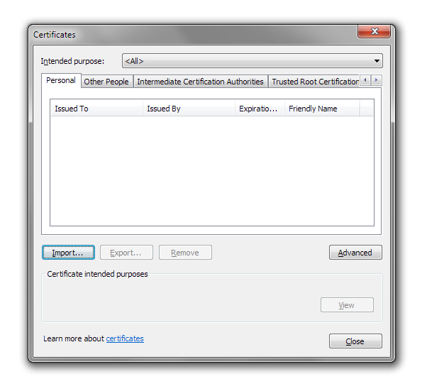
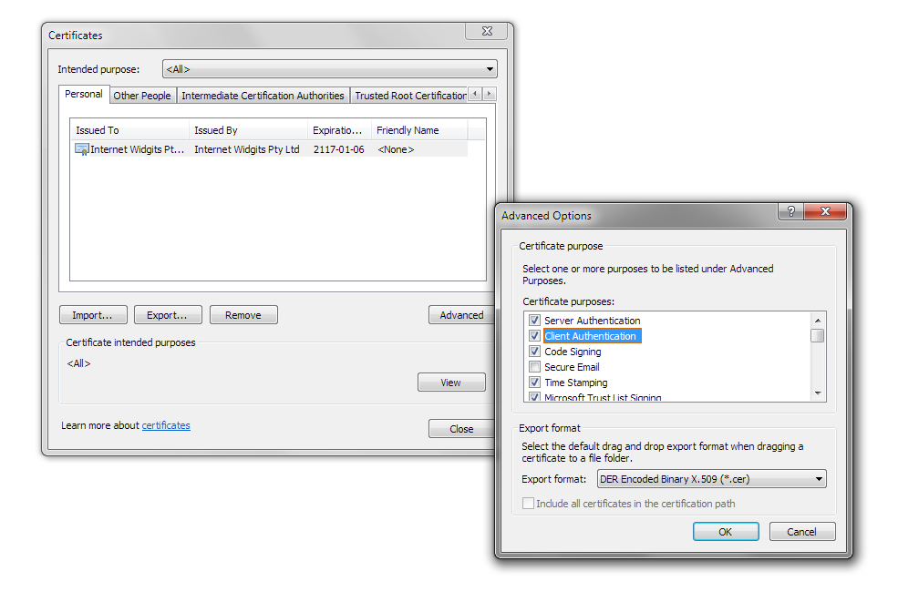
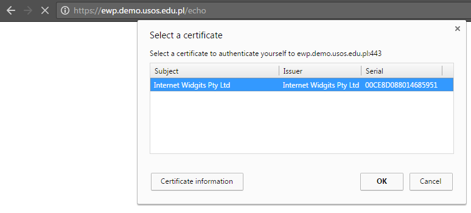
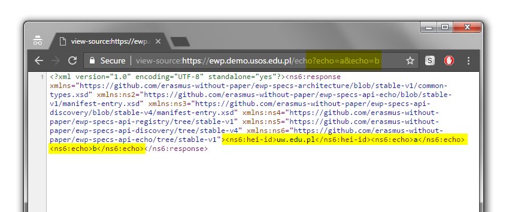

Authenticating Clients with TLS Certificate
===========================================

This document describes how to accomplish EWP client authentication with the
use of TLS Client Certificates.

* [What is the status of this document?][statuses]
* [See the index of all other EWP Specifications][develhub]


Status
------

This method of client authentication is [planned to be
deprecated](https://github.com/erasmus-without-paper/ewp-specs-architecture/issues/17#issuecomment-292967277)
soon. However, currently all implementers are still REQUIRED to support it. An
alternative method of client authentication will be specified soon.

Why is it planned to be deprecated?:

 * It turned out that [in some cases][norway-case] institutions are *unable* to
   configure their proxies to accept TLS client certificates.


Introduction
------------

This authentication method requires TLS (HTTPS) to be used. In TLS, there are
two types of certificates which all implementers must be aware of:

 * **Server certificates** are used to authenticate the server. These are
   always used during the TLS handshake, and we describe them in a [separate
   document][srvauth-tlscert].

 * **Client certificates** can *optionally* be used during TLS handshake to
   authenticate the client.

This authentication method REQUIRES that the client certificates are used
during the TLS handshake, thus allowing the server to identify the requester.
At this point, no man-in-the-middle/replay-attacks can be performed.

Implementers MAY use the same certificate for both purposes (as a server
certificate, and as a client certificate).


Implementing a server
---------------------

### Self-signed vs CA-signed

Clients can use both
[CA-signed](https://en.wikipedia.org/wiki/Certificate_authority) certificates
or [self-signed](https://en.wikipedia.org/wiki/Self-signed_certificate) ones.
Currently, this authentication method REQUIRES servers to accept both of these
types. However, in the near future, we will also design a way for the servers
to "say", that they will accept only CA-signed certificates.

 * Note, that this choice does not influence transport security in any way.
   In this particular context, self-signed certificates are **exactly as
   secure** as the CA-signed certificates, because - either way - clients MUST
   use the Registry API for validating the client certificates, regardless of
   who they were signed by.

 * With such external validation, certificates are only containers for the
   cryptographic keys, and *it is the Registry* who decides if the client
   should trust the key or not. Revoking a certificate is as easy as removing
   it from the manifest file. You can discuss this in [this
   thread][the-thread].

It is however RECOMMENDED that clients use a CA-signed certificates only.
Here's why:

 * Unfortunately, we learned that some servers may have problems accepting
   self-signed certificates, because **their proxies** [don't easily allow
   them][no-ca-problem] to do that.

   - BTW, later on, it turned out that in some cases, like that [in
     Norway][norway-case], even CA-signed certificates cannot be accepted be
     the server. This started the "downfall" of this method of authentication
     in EWP, and is the main reason why it is now deprecated.


### Ask for certificate during TLS handshake

You MUST ask the client for its certificate (send a "client certificate
request" message during the TLS handshake). If you use an external HTTPS
server/proxy (like Apache), you should configure it to accept client
certificates.

If the client doesn't supply it, then the client doesn't want to use this
method of authentication, or it uses it improperly.

 * If you support other client authentication methods at this endpoint, then
   you should try detecting if the client uses any of those. If the client
   doesn't seem to be using any of them, then you SHOULD respond with HTTP 401.

 * If you don't support any other client authentication methods at this
   endpoint, then you SHOULD respond with either HTTP 401 or HTTP 403 with
   proper `developer-message`.


### Validate the certificate

You MUST verify if the request is coming from within the EWP Network.

The certificate's SHA-256 fingerprint MUST match at least one of the
fingerprints published in the [Registry Service][registry-api]. As it has
been explained in the Registry API specification - changes in the catalogue
SHOULD be picked up by your application *minutes* after they happen.

If you cannot find a match, then you SHOULD respond with HTTP 403 with proper
`developer-message`.

You MAY reject expired certificates. This is not vital to security because, as
we explained above, certificates are only used as containers for cryptographic
keys.


### Identify the covered HEIs

In most cases, you will also need to identify which HEIs are covered by the
requester (most APIs will require that). Note, that there can be any number of
them (`0..*`, see discussion
[here](https://github.com/erasmus-without-paper/ewp-specs-api-echo/issues/3)).

In the previous steps you have already found a *list* (!) of `<host>` elements
bound to the client certificate. Now, you will need to build on that
information, and retrieve *the list of HEIs these hosts cover*. Consult
[Registry API specification][registry-api] for useful hints (i.e. examples of
XPath expressions).


Implementing a client
---------------------

### Acquire a certificate

First, you will need to acquire a certificate with which you will be signing
your requests. It is RECOMMENDED to acquire a CA-signed certificate, but you
MAY also try using a self-signed one (remember that servers will be allowed to
NOT accept self-signed certificates in near future).


### Publish your choice

Each partner declares (in his [Manifest file][discovery-api]) a list of
certificates it will use for making requests to other hosts. This list is
later fetched by registry, and the **fingerprints** of these certificates are
served to all servers to see (see [Registry API][registry-api] for details).

Usually (but not necessarily always) you will bind your client certificate to
all HEIs you cover. Once the server confirms that the client is in possession
of a proper private key of the certificate (this is the part of the TLS
Handshake), it is then able to identify (with the help of the Registry again)
which HEIs such client covers.

Note, that the Registry will verify if your keys meet certain security
standards (i.e. its length). These standards MAY change in time. Remember to
include `<admin-email>` elements in your manifest file if you want to be
notified about such changes.


### Make the request

When constructing your HTTPS client, instruct it to make use of your client
certificate ([code
sample](https://github.com/erasmus-without-paper/ewp-registry-service/blob/ff4a586bbf85db83252bf62d86cd2af5a332b0f4/src/main/java/eu/erasmuswithoutpaper/registry/echotester/SimpleEwpClient.java)).
This should be enough.


Security considerations
-----------------------

### Main security questions

The [Authentication and Security][sec-intro] document
[recommends][sec-method-rules] that each client authentication method
specification explicitly answers the following questions:

> How can the server verify which HEIs are covered by the requester?

Each client certificate is bound to specific set of HEIs. This relationship is
published by the Registry.

> How can the server verify that the request has not been tampered with, nor
> replayed by a third party?

TLS prevents that.

> Does it provide non-repudiation? Can a server provide a solid proof later
> on, that a particular request took place, and that it originated from a
> certain client?

No. In theory, recording entire TLS session can provide this proof, but this is
hard to achieve. TLS has not been designed for non-repudiation.


Example: Making requests with your browser
------------------------------------------

One of the advantages of this method of client authentication is that **it is
supported by most major browsers**.

These command samples will show you how a self-signed client certificate can be
installed in your browser for easy debugging. Remember, that soon servers won't
accept self-signed certificates, but the process of installing a CA-signed
certificate is almost identical (steps 1-2 might need to be replaced though).

1. **Generate a key-pair and a corresponding certificate.** The key-pair will
   initially be encrypted with the password you provide:

   ```bash
   openssl req -x509 -newkey rsa:2048 -keyout browser.key.pem -out browser.crt.pem -days 36500
   ```

2. **Decrypt your key-pair file**. This step in not strictly required, but it
   makes your work easier (you won't need to supply a password every time
   you'll want to use the key).

   ```bash
   openssl rsa -in browser.key.pem -out browser.key.pem
   ```

3. **Paste your new public certificate into your manifest file.** Use the
   base64-encoded part from `browser.crt.pem` file. It should look like
   [this](https://github.com/erasmus-without-paper/ewp-specs-api-discovery/blob/v4.0.1/manifest-example.xml#L66).

   Note, that it doesn't have to be the same manifest file you publish your
   Echo API with. It needs to be registered in the EWP Registry though. The
   point of publishing it, is to inform the EWP Network (including **your own**
   Echo API) that you will be using it.

4. **Convert to PFX format.** This step might be unnecessary, if your system
   and/or browser allows you to import certificates in other formats. Note,
   that you don't need to supply the export password (you can leave it empty).

   ```bash
   openssl pkcs12 -inkey browser.key.pem -in browser.crt.pem -export -out browser.pfx
   ```

5. **Import the PFX certificate into your browser.** For example, in Chrome it
   looks like this:

   * Go to settings and type "cert" in search box. You should see "Manage
     certificates..." button.

   * In *Personal* tab, click "Import...".

     

   * Continue to import the certificate from your `browser.pfx` file.

   * Once you're done, make sure that the certificate is marked to be used for
     Client Authentication.

     

6. **Test it.** If you have installed your certificate successfully **AND** if
   you have implemented Echo API with TLS Client Certificate Authentication,
   then you should see the following when you visit your Echo API URL in your
   browser:

   

   Your browser should ask you which client certificate you want to use for
   this session. Note, that this decision is cached by the browser for a
   duration of the session. So, if you want to test your Echo API with multiple
   client certificates, then you will probably want to do this in an *Incognito
   Window*.

   If your Echo API works correctly **AND** the information about your client
   certificate has already propagated through the network (see point 3 above),
   then you should see a valid Echo API response. Note, that `<hei-id>` values
   depend on the values of
   [`<institutions-covered>`](https://github.com/erasmus-without-paper/ewp-specs-api-discovery/blob/v4.0.1/manifest-example.xml#L58)
   in your manifest file.

   


[discovery-api]: https://github.com/erasmus-without-paper/ewp-specs-api-discovery
[develhub]: http://developers.erasmuswithoutpaper.eu/
[statuses]: https://github.com/erasmus-without-paper/ewp-specs-management/blob/stable-v1/README.md#statuses
[registry-api]: https://github.com/erasmus-without-paper/ewp-specs-api-registry
[the-thread]: https://github.com/erasmus-without-paper/ewp-specs-architecture/issues/17
[solutions-123]: https://github.com/erasmus-without-paper/ewp-specs-architecture/issues/17#issuecomment-275649771
[no-ca-problem]: https://github.com/erasmus-without-paper/ewp-specs-architecture/issues/17#issuecomment-278275252
[norway-case]: https://github.com/erasmus-without-paper/ewp-specs-architecture/issues/17#issuecomment-285295266
[cliauth-none]: https://github.com/erasmus-without-paper/ewp-specs-sec-cliauth-none
[cliauth-tlscert]: https://github.com/erasmus-without-paper/ewp-specs-sec-cliauth-tlscert
[cliauth-httpsig]: https://github.com/erasmus-without-paper/ewp-specs-sec-cliauth-httpsig
[srvauth-tlscert]: https://github.com/erasmus-without-paper/ewp-specs-sec-srvauth-tlscert
[srvauth-httpsig]: https://github.com/erasmus-without-paper/ewp-specs-sec-srvauth-httpsig
[sec-method-rules]: https://github.com/erasmus-without-paper/ewp-specs-sec-intro#rules
[sec-intro]: https://github.com/erasmus-without-paper/ewp-specs-sec-intro
